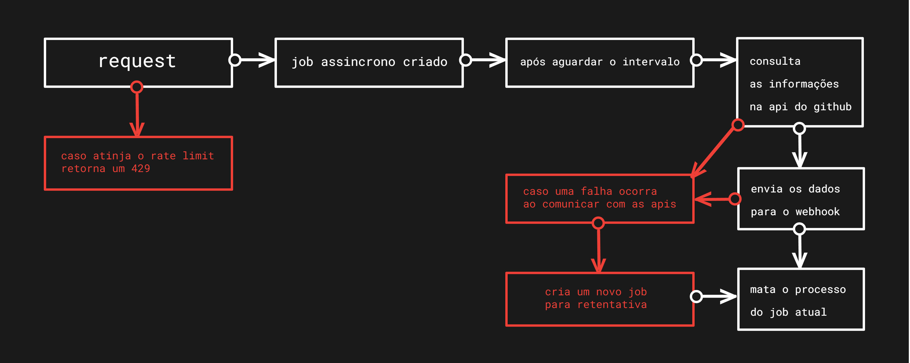

# Hookme

## Instalação
  No projeto consta um arquivo docker-compose.yml caso possua o docker instalado basta rodar:
```
docker-compose up -d --build
```
 Para rodar manualmente é necessario instalar as dependencias:
 ```
mix deps.get
```
E rodar:
```
mix run --no-halt
```

## Sobre os envs
No arquivo docker-compose.yml existe uma série de variaveis que podemos usar para customizar a aplicação:
 - **SCHEDULE_INTERVAL** -> *Representa o tempo de assincronicidade da request em milisegundos, ou seja quanto um processo vai precisar esperar para enviar as informações para o webhook*
 - **RESCHEDULE_INTERVAL** -> *Representa quanto tempo um processo de retentativa vai esperar em milisegundos, caso a primeira request falhe podemos setar a retentativa para occorrer x milisegundos após a primeira*
 - **RETRY_MAX_ATTEMPTS** -> *Representa quantas retentativas a aplicação tentará fazer para uma determinada task*
 - **WEBHOOK_URL** -> *A url do webhook para qual vamos mandar as informações nos jobs*
 - **API_URL** -> *Link para a api desejada, no caso o link da api do github*
 - **API_TOKEN** -> *Caso queira autenticar na api do github coloque o seu token de acesso aqui, caso queira usar a api do github sem autenticar apenas deixe essa variavel como: ""*
 - **RATE_LIMIT_MAX_SIMULTANEOUS_JOBS** -> *Caso queira adicionar um rate limit para não permitir que a aplicação tenha mais de X jobs assincronos rodando sete a variavel para um numero inteiro de sua preferencia, caso não queira usar o rate limit apenas deixe essa variavel como: -1*

## Sobre os endpoints
A aplicação possui apenas um endpoint */tasks* 
  - **[POST]** *http://localhost:4001/tasks*
    - ```
        {
        	"username": "KevinDaSilvaS",
        	"repository": "duper"
        }
      ```

## Sobre o fluxo da arquitetura
  
  
## Sobre as escolhas tecnicas
Quando surge o desafio de criar um serviço para agregar informações de uma serie de endpoint e envia-los de forma assincrona começamos a pensar nas tecnologias, e quais seriam o estado da arte e as primeiras que nos veem a mente são
 - **phoenix** o canhão do desenvolvimento web com alta gama de funcionalidades
 - **oban** para rodar diversos jobs assincronos e com retry e alta resiliencia
 - **ETS** para um caching super eficiente na maquina virtual do Erlang

#

Mas analisando mais cuidadosamente o problema fiz as seguintes perguntas:
 - Vou lidar com muitos endpoints, sockets, channels e tudo o que há de bom?
     - Resposta: Não na verdade só terei um endpoint para enviar o **username** e o **repository** então uma abordagem mais simples talvez deva ser usar o **Plug** ao invés do phoenix pela simplicidade ao mesmo tempo em que o Plug é a base do phoenix que nada mais é que uma composição de simples plugs
 - A abordagem mais simples inicialmente é usar Oban com todo o tempo inicial de configuração e de adicionar um Postgres?
     - Resposta: Não, na verdade a maneira mais simples e incremental seria usar o modulo Task e criar uma task assincrona para cada job e adicionar uma politica de retentativa caso uma task não consiga finalizar com sucesso o envio de dados para o webhook
 - Manter um caching de usuarios/repositorios para evitar ddos e tambem manter um caching de usuarios buscados na api do github é muito essencial para performance, mas precisamos iniciar com um ETS?
     - Resposta: Como não vamos iniciar de maneira mais robusta em mais de uma maquina podemos tomar uma abordagem de usar Agents para o controle de informações visto que é a finalidade desse modulo guardar estados e se necessario adicionar um maximo de jobs no cache

## Validações extras
  - [Impedir duplicadas] - Hoje se guarda cada job/task com uma chave *${username}/${repository}* com a intenção de impedir eventual ddos de multiplos jobs para o mesmo usuario e repositorio, então hoje só é permitido um job/task simultaneo para o mesmo usuario/repositorio
  - [Impedir aobrecarga] - Pode se adicionar um rate limit na aplicação impedindo-a de criar mais de X jobs assincronos simultaneos
